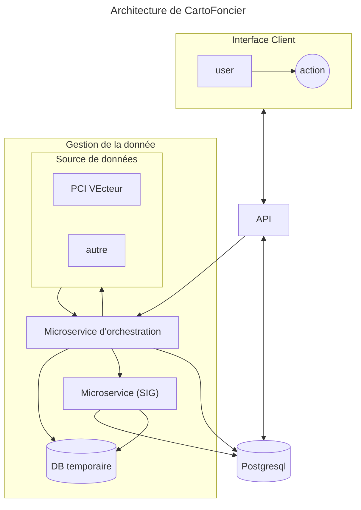

# API App foncière (CartoFoncier)

API pour la gestion des users et des notifications et l'authentification
Microservice pour les traitements SIG
Description du projet avec liens externes...

## Code Flow

Explication du fonctionnement global de l'application, des traitements SIG réalisé avec geopandas, les différents model de base de données utilisées$, etc.

## System requirements

* git
* Docker desktop

## Setup

First clone the repo
`git clone <this repo>
cd <repo name>`

run
`docker compose up`

The swagger generated documentation should be available at this address  once the containers are running.

